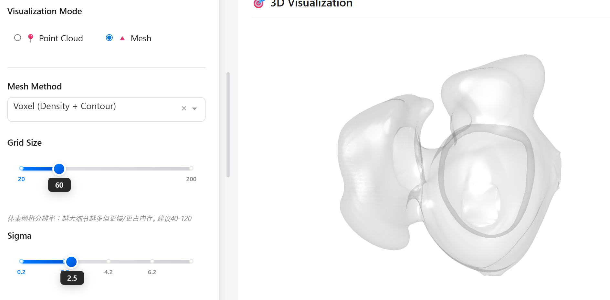
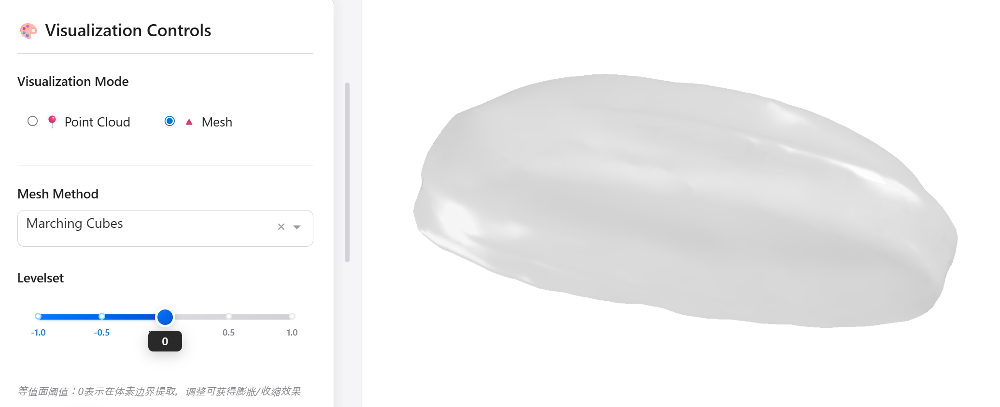
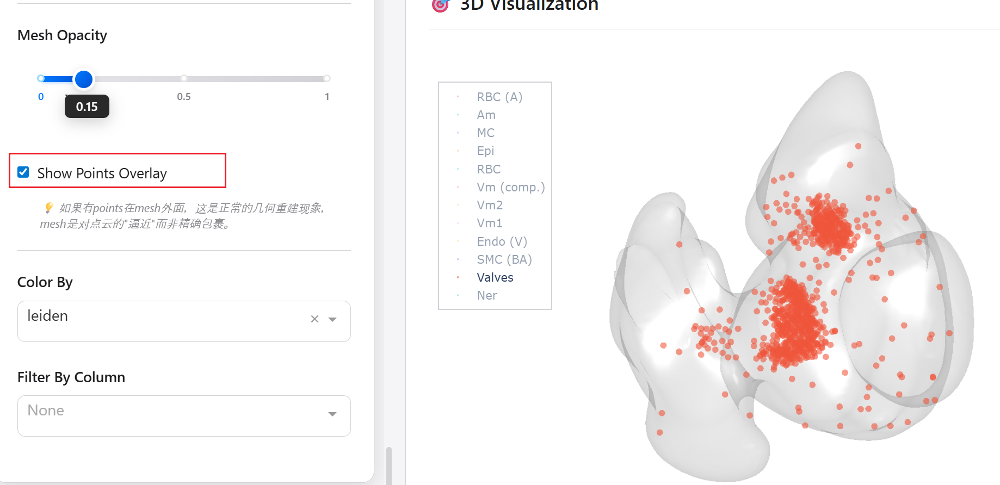
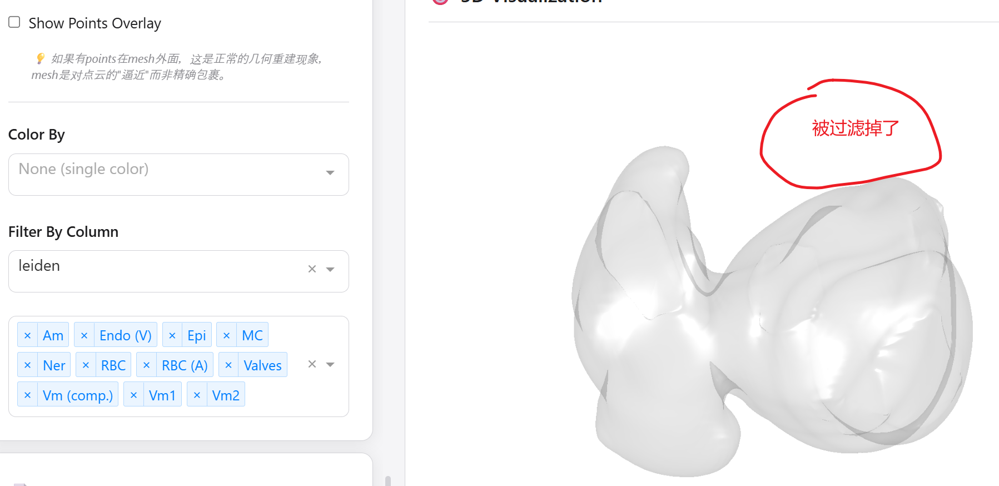

# 1 Spatial3D 
空间组学3D重构
 
# 2 空间转录组 3D 重构实战 
- 配准：推荐paste/paste2, 准确快速。 
- surface构建：推荐voxel/Marching Cubes这2种方法 

# 3 交互式可视化开发
  - 下载app里面的全部代码
  - 配置环境，安装所需包 
  - 启动环境，进入app目录，运行 `python app.py`
  - 数据输入格式参考example目录，必须包含x,y,z散列

---------------------------

# 4 App用法展示 

## 4.1 Point Cloud 可视化模式   
  - Point Size：调整点的大小
  - Opacity：调整点的透明度 
  - Expand Z: 调整Z轴间的间距（主要用于可视化Z轴方向的变化） 
  
**4.1.1 原始结果**

**4.1.2 调整point size结果**  

**4.1.3 改变Expand Z的结果**  

-------------
## 4.2 Mesh 可视化模式 
  - Voxel 模式
  - Marching Cubes 模式  
    
### 4.2.1 Voxel 模式 
  - 导入数据，并选择 Voxel 模式
  - 点击 `Render Mesh` 按钮进行渲染 
  - 参数的具体用法见说明
  
 

### 4.2.2 Marching Cubes模式 
 

### 4.2.3 同时展示points + Mesh  
  - 在`Mesh`模式下，勾选`Show Points Overlay`

###  4.2.4 全局参数 
    - Color By：point按照哪一列进行着色 
    - Filter By Column：按照哪一列对数据进行筛选 

